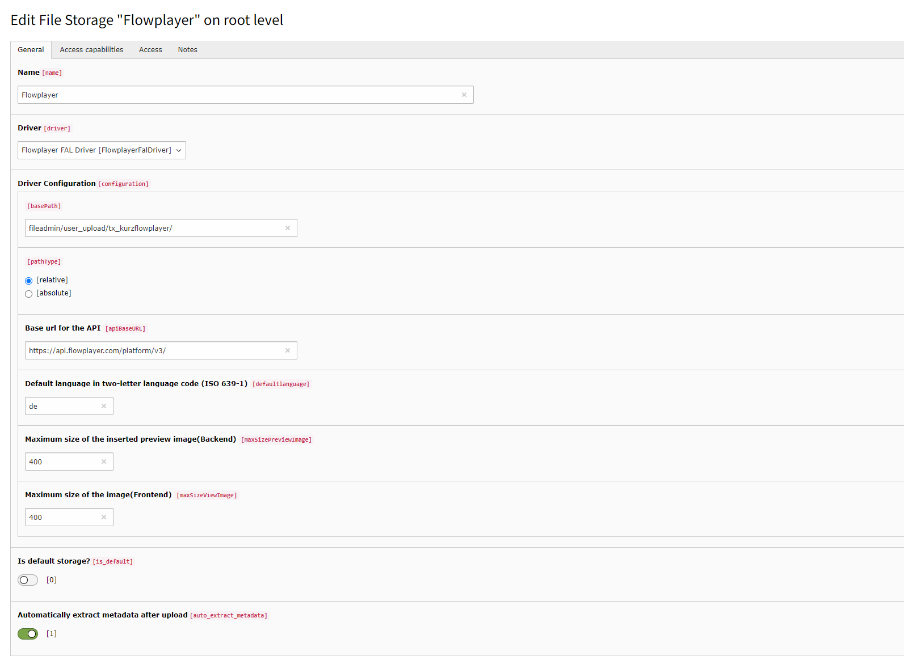

# flowplayer extension for TYPO3 CMS

The flowplayer extension provides an extended local driver for the TYPO3 File Abstraction Layer (FAL) with the possibility to place videos on the webpage to use the flowplayer API.
The Flowplayer is an Open Source (GPL 3) video player for the web. For more informations see https://flowplayer.com/

[Flowplayer OVP API](https://flowplayer.com/developers/platform-api/api-reference-3.0)

## When do I need this extension?

This extension is intended to be used to integrate your TYPO3 CMS with flowplayer platform for managing video and livestream assets.
With this extension you can fetch und list Videos, Livestreams, Live Sources, Playlists and Categories from flowplayer platform on your TYPO3 Website.

## How to install this extension?

You can set this up via composer (`composer require kurz/kurz-flowplayer`) or via
TER (extension name "kurz_flowplayer"), it runs with TYPO3 v8 LTS, TYPO3 v9 LTS und TYPO3 v10 LTS.

## Include static template

In your main Template include the "static TypoScript template" of the extension kurz_flowplayer.</h4>
<ol>
  <li>Switch to the Template module and select Info/Modify.</li>
  <li>Switch to the root page of your site and press the link Edit the whole template record and switch to the tab Includes.</li>
  <li>Select FAL flowplayer Driver (kurz_flowplayer) at the field Include static (from extensions):</li>
</ol>

## Create a File Storage Record

Add a new file storage with the "Flowplayer" driver to root page.

If you go to the Filelist module, you should see your Flowplayer File Storage there.

## Flowplayer Administration Module

<h4>Add new Workspace</h4>
In Administration Module from Flowplayer you can add of multiple workspaces (sometimes referred to as sites) within your organization. A workspace is a sub-grouping of your videos and can be found in the leftmost sidebar of flowplayer administration site (https://flowplayer.com/login).

Each workspace has a unique list of videos and livestreams. In addition each workspace has a separate set of metadata including for example tags, categories and custom metadata fields. 

<h4>Add new Player</h4>

## License

The extension is licensed under GPL v2+, same as the TYPO3 Core.

